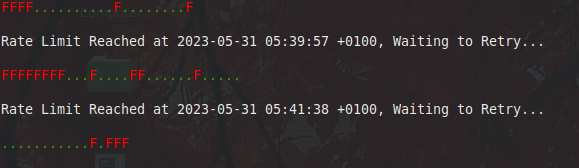
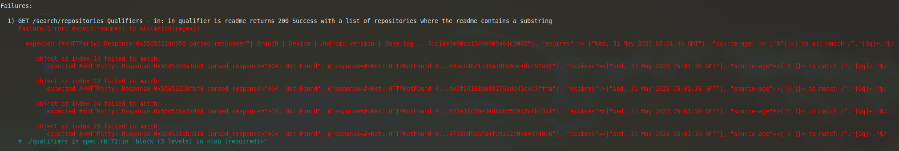
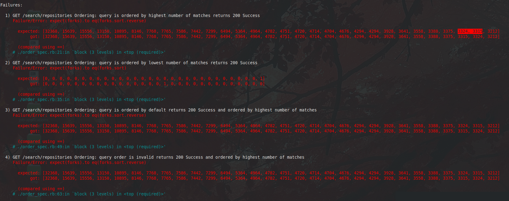

# Github Repository Search API Testing

## Setup
```
\curl -sSL https://get.rvm.io | bash
rvm install "ruby-2.7.8"

`/bin/bash --login`
rvm use 2.7

bundle install
```

## Testing

```
rails s
rspec spec/*_spec.rb
```

## Issues / Troubleshooting

- The rate limiter can cause failures intermittently, limits are 10 requests per second or 30 if authenticated
	- I mitigated this by adding a pause/retry if the request is rejected (403: Forbidden)



- The size:n qualifier can return values which don't match exactly

- The in:readme qualifier returns repositories with no readme file
	- This may be because the url is different than expected for some cases



- The ordering of results is incorrect in several places which resulted in some test failures.



- The followers qualifier is difficult to test because the followers_url attribute links to the user's followers as opposed to the repo's followers
	- Finding a user with only one repository and who has followers may get around this

- The mirrored:true qualifier is difficult to test because the responses don't contain anything to compare with.

- Didn't test Status: 304 - Not modified as this is a GET endpoint, not sure how to trigger this

- Missing test data causing some failures (Stubbed for now but need to find or make some users/repos/issues to test properly):

	- The is:private qualifier fails because I need to find a private repo to use

	- The archived:false qualifier returns repositories with an archive_url, so this can't be used to identify them
		- Need to find another way to test this
	- good-first-issues
	- help-wanted-issues

- More testing could include testing the rate limiter itself, or using the benchmark gem to validate the response times of larger requests

---

Feel free to message me any time at chrismullensw@gmail.com with any questions or problems.